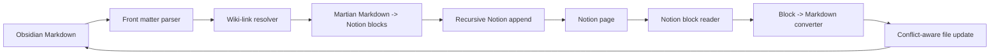

# Notional

Sync Obsidian notes with Notion pages without turning your vault into a
one-way export graveyard.

Notional is a maintained Obsidian plugin for people who write in Markdown, live
in Notion with teams or clients, and want the two worlds to stay connected. It
started as a fork of the abandoned Nobsidion plugin; today it is being rebuilt
into a practical, reviewable, two-way sync tool with explicit conflict handling
and no silent overwrites.

[](https://github.com/bryanbans/Notional/releases)
[](https://github.com/bryanbans/Notional/actions/workflows/ci.yml)
[](LICENSE)
[](manifest.json)

> The point is not to make Notion replace Obsidian, or Obsidian replace Notion.
> The point is to keep the same note understandable on both sides.

## What It Does

| Capability | Status |
| --- | --- |
| Push the current note to Notion | Stable |
| Push the whole vault with bounded parallelism | Stable |
| Create Notion pages for linked notes | Stable |
| Convert Obsidian wiki-links to Notion page mentions | Stable |
| Upload deeply nested blocks past Notion's append limit | Stable |
| Pull a linked Notion page back into Obsidian | Working, conservative |
| Detect local-vs-remote conflicts | Working |
| Automatic sync | Experimental, opt-in |

## The Sync Contract

Notional is intentionally conservative:

1. A note gets linked to a Notion page through YAML front matter.
2. Push writes Markdown content into Notion blocks.
3. Pull converts supported Notion blocks back into Markdown.
4. Sync chooses a direction from timestamps.
5. If both sides changed, Notional stops and asks you which side to keep.

No hidden merge magic. No background overwrite surprise. If the plugin is not
confident, it pauses.

## Quick Start

### 1. Install

Use BRAT while Notional is moving quickly:

```text
bryanbans/Notional
```

Or install manually from the latest release:

```text
<vault>/.obsidian/plugins/notional/
  main.js
  manifest.json
  styles.css
```

Reload Obsidian, then enable Notional under Community Plugins.

### 2. Connect Notion

In Settings -> Notional:

1. Create a Notion connection at https://www.notion.so/my-integrations.
2. Paste the connection token into Notional.
3. Click Test connection.
4. Share a Notion parent page with that connection.
5. Paste the page link into Notional and click Create notes database.

Notional creates the database for you. You do not need to hunt for a database
ID unless you want to use an existing database manually.

### 3. Sync a Note

Open a Markdown note, then use either:

- the sync ribbon icon
- the Open sync panel command
- the command palette actions listed below

For a first run, use Push. After the note is linked, use Sync for the safer
timestamp-based path.

## Commands

| Command | What it does |
| --- | --- |
| Upload current note to Notion | Pushes the active file |
| Upload entire vault to Notion | Pushes Markdown files with bounded concurrency |
| Pull current note from Notion | Updates the active file from its linked Notion page |
| Sync current note with Notion | Chooses push or pull from sync metadata |
| Open sync panel | Opens the side panel for the active note |

## Sync Panel

The side panel is the cockpit:

- linked or unlinked state
- last local sync time
- last Notion edit time
- local-change and remote-change flags
- one-click Sync, Push, and Pull
- explicit conflict resolution
- recent activity log

When a conflict appears, Notional gives you two deliberate choices:

- Keep local: push Obsidian to Notion
- Keep Notion: force-pull Notion to Obsidian

## Metadata

Notional stores its sync state in the note itself:

```yaml
notionPageId: ...
notionPageUrl: ...
notionLastEditedTime: ...
obsidianLastSyncedAt: ...
```

That makes the link portable with the file and keeps the current implementation
easy to inspect. A dedicated sync-state store is on the roadmap for richer
whole-vault automation.

## Under The Hood



The code is split around the sync pipeline:

| File | Responsibility |
| --- | --- |
| `main.ts` | Plugin lifecycle, commands, vault file map, autosync wiring |
| `view.ts` | Sync side panel and conflict actions |
| `settingTab.ts` | Notion connection and setup UI |
| `service/index.ts` | Upload, pull, sync orchestration |
| `service/notion.ts` | Raw Notion REST calls and block conversion |
| `service/utils.ts` | Front matter, wiki-link parsing, URL helpers |
| `service/types.ts` | Shared settings and sync result types |

## Current Limitations

- Pull conversion covers common blocks: paragraphs, headings, lists, todos,
  quotes, code, dividers, images, tables, callouts, toggles, equations, and
  media links.
- Unsupported Notion blocks are flagged with a `> [!missing]` callout instead
  of being dropped silently.
- Automatic sync is currently scoped to the open note: push after edit, pull on
  an interval, conflicts deferred to the panel.
- Conflict handling is side-based. There is no line-level merge UI yet.

## Roadmap

Recently shipped:

- parallel vault upload
- deep nested block append
- wiki-links as Notion page mentions
- pull and sync commands
- timestamp conflict detection
- guided setup with connection testing and database creation
- sync side panel
- opt-in automatic sync
- Marketplace review cleanup through release `1.1.11`

Next:

- one-click OAuth connection flow
- whole-vault background sync for linked notes
- dedicated sync-state store
- richer pull conversion for edge-case Notion blocks
- Obsidian community plugin submission

## Development

Requires Node.js. CI builds on Node 20.

```bash
npm install
npm run build
npm run lint
npm test
```

Release assets are `main.js`, `manifest.json`, and `styles.css`. Tagging a
commit whose name matches the `manifest.json` version, without a `v` prefix,
publishes a GitHub release with those assets.

## Acknowledgements

Notional is a maintained fork of the original Nobsidion work by
[Quan Phan](https://github.com/quanphan2906), which itself traces back to
[Obsidian to Notion](https://github.com/EasyChris/obsidian-to-notion/) by
[EasyChris](https://github.com/EasyChris).

## License

Notional is released under the [GNU General Public License v3.0](LICENSE).
