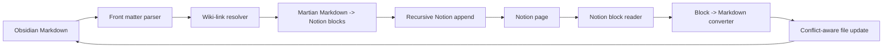

# Notional

A practical Obsidian to Notion sync plugin for people who write in Markdown but
need to collaborate, publish, or report in Notion.

Notional keeps Obsidian notes and Notion pages connected without turning your
vault into a one-way export folder. It is built for knowledge workers who want
Obsidian as their thinking environment and Notion as a shared workspace, client
portal, project hub, or lightweight CMS.

[](https://github.com/bryanbans/Notional/releases)
[](https://github.com/bryanbans/Notional/actions/workflows/ci.yml)
[](LICENSE)
[](manifest.json)

Notional started as a maintained fork of the abandoned Nobsidion plugin. The
current goal is broader: a reliable, inspectable, two-way sync tool with clear
conflict handling and no silent overwrites.

## Why Notional Exists

Many teams split their work across two very different tools:

- Obsidian is excellent for private notes, local Markdown, backlink-heavy
  research, and fast writing.
- Notion is excellent for shared workspaces, databases, client-facing pages,
  planning boards, and team review.

The problem is the handoff. Copying Markdown into Notion breaks links, loses
structure, and creates stale duplicates. Exporting everything is too blunt.
Manual round-tripping is error-prone.

Notional is designed to make that handoff deliberate, repeatable, and safer.

## Real-World Use Cases

| Situation | Problem | How Notional helps |
| --- | --- | --- |
| Consultant notes to client portal | You draft privately in Obsidian, but clients expect polished Notion pages. | Push selected notes or a project folder into Notion while keeping Obsidian as the source workspace. |
| Research to team knowledge base | Your research notes contain wiki-links and nested outlines that become flat, broken copy-paste dumps. | Convert wiki-links into Notion page mentions and preserve nested structure through recursive block upload. |
| Meeting notes to shared follow-up | Notes start locally during calls, then need to become shared Notion documentation. | Upload the active note, link it to a Notion page, and continue syncing updates intentionally. |
| Product or engineering docs | Drafting is faster in Markdown, but review and discovery happen in Notion. | Keep local Markdown files linked to Notion pages with timestamp-based conflict checks. |
| Personal knowledge to public workspace | You want to publish only a subset of your vault, not expose every local file path. | Current-folder upload avoids default whole-vault enumeration and keeps publishing scoped. |
| Notion edits back to Obsidian | Teammates adjust a Notion page after you pushed it. | Pull supported Notion blocks back into the linked Obsidian note, with conflicts surfaced before overwrite. |

## Core Capabilities

| Capability | Status |
| --- | --- |
| Push the current note to Notion | Stable |
| Push the current folder with bounded parallelism | Stable |
| Create Notion pages for linked notes | Stable |
| Convert Obsidian wiki-links to Notion page mentions | Stable |
| Upload deeply nested blocks past Notion's append limit | Stable |
| Pull a linked Notion page back into Obsidian | Working, conservative |
| Detect local-vs-remote conflicts | Working |
| Automatic sync | Experimental, opt-in |

## Sync Model

Notional is intentionally conservative.

1. A note is linked to a Notion page through YAML front matter.
2. Push converts Markdown into Notion blocks.
3. Pull converts supported Notion blocks back into Markdown.
4. Sync chooses a direction from stored timestamps.
5. If both sides changed, Notional stops and asks which side to keep.

There is no hidden merge magic. There is no background overwrite surprise. If
Notional is not confident, it pauses and lets you decide.

## Quick Start

### 1. Install

Use BRAT while Notional is moving quickly:

```text
bryanbans/Notional
```

Or install manually from the latest release:

```text
<vault>/.obsidian/plugins/notional/
  main.js
  manifest.json
  styles.css
```

Reload Obsidian, then enable Notional under Community Plugins.

### 2. Connect Notion

In Settings -> Notional:

1. Use Connect with Notion if OAuth is configured. This opens Notion's page
   picker, then exchanges the returned code through a hosted token endpoint.
2. If OAuth is not configured yet, create a Notion connection at
   https://www.notion.so/my-integrations.
3. Paste the connection token into Notional.
4. Click Test connection.
5. Share a Notion parent page with that connection.
6. Paste the page link into Notional and click Create notes database.

Notional creates the database for you. You do not need to hunt for a database ID
unless you want to use an existing database manually.

OAuth note: Notion requires the OAuth client secret during token exchange, so
the plugin cannot safely do that exchange by itself. Notional supports a
configurable hosted exchange endpoint under Advanced -> OAuth; until that
endpoint is deployed, the manual token flow remains the reliable path.

### 3. Sync a Note

Open a Markdown note, then use either:

- the sync ribbon icon
- the Open sync panel command
- the command palette actions listed below

For a first run, use Push. After the note is linked, use Sync for the safer
timestamp-based path.

## Commands

| Command | What it does |
| --- | --- |
| Upload current note to Notion | Pushes the active file |
| Upload current folder to Notion | Pushes Markdown files from the active note's folder; root notes upload alone |
| Pull current note from Notion | Updates the active file from its linked Notion page |
| Sync current note with Notion | Chooses push or pull from sync metadata |
| Open sync panel | Opens the side panel for the active note |

## Sync Panel

The side panel is the operational view for the active note:

- linked or unlinked state
- last local sync time
- last Notion edit time
- local-change and remote-change flags
- one-click Sync, Push, and Pull
- explicit conflict resolution
- recent activity log

When a conflict appears, Notional gives you two deliberate choices:

- Keep local: push Obsidian to Notion
- Keep Notion: force-pull Notion to Obsidian

## Metadata

Notional stores sync state in each note's YAML front matter:

```yaml
notionPageId: ...
notionPageUrl: ...
notionLastEditedTime: ...
obsidianLastSyncedAt: ...
```

That makes the link portable with the file and keeps the current implementation
easy to inspect. A dedicated sync-state store is on the roadmap for richer
whole-vault automation.

## Architecture



The code is split around the sync pipeline:

| File | Responsibility |
| --- | --- |
| `main.ts` | Plugin lifecycle, commands, scoped folder upload, autosync wiring |
| `view.ts` | Sync side panel and conflict actions |
| `settingTab.ts` | Notion connection and setup UI |
| `service/index.ts` | Upload, pull, sync orchestration |
| `service/notion.ts` | Raw Notion REST calls and block conversion |
| `service/utils.ts` | Front matter, wiki-link parsing, URL helpers |
| `service/types.ts` | Shared settings and sync result types |

## Current Limitations

- Pull conversion covers common blocks: paragraphs, headings, lists, todos,
  quotes, code, dividers, images, tables, callouts, toggles, equations, and
  media links.
- Unsupported Notion blocks are flagged with a `> [!missing]` callout instead
  of being dropped silently.
- Automatic sync is currently scoped to the open note: push after edit, pull on
  an interval, conflicts deferred to the panel.
- Conflict handling is side-based. There is no line-level merge UI yet.

## Roadmap

Recently shipped:

- plugin-side Notion OAuth flow with configurable token exchange endpoint
- scoped current-folder upload that avoids whole-vault file enumeration
- deep nested block append
- wiki-links as Notion page mentions
- pull and sync commands
- timestamp conflict detection
- guided setup with connection testing and database creation
- sync side panel
- opt-in automatic sync
- Marketplace review cleanup through release `1.1.13`

Next:

- hosted OAuth token exchange endpoint and public Notion connection
- whole-vault background sync for linked notes
- dedicated sync-state store
- richer pull conversion for edge-case Notion blocks
- Obsidian community plugin submission

## Development

Requires Node.js. CI builds on Node 20.

```bash
npm install
npm run build
npm run lint
npm test
```

Release assets are `main.js`, `manifest.json`, and `styles.css`. Tagging a
commit whose name matches the `manifest.json` version, without a `v` prefix,
publishes a GitHub release with those assets.

## Acknowledgements

Notional is a maintained fork of the original Nobsidion work by
[Quan Phan](https://github.com/quanphan2906), which itself traces back to
[Obsidian to Notion](https://github.com/EasyChris/obsidian-to-notion/) by
[EasyChris](https://github.com/EasyChris).

## License

Notional is released under the [GNU General Public License v3.0](LICENSE).
