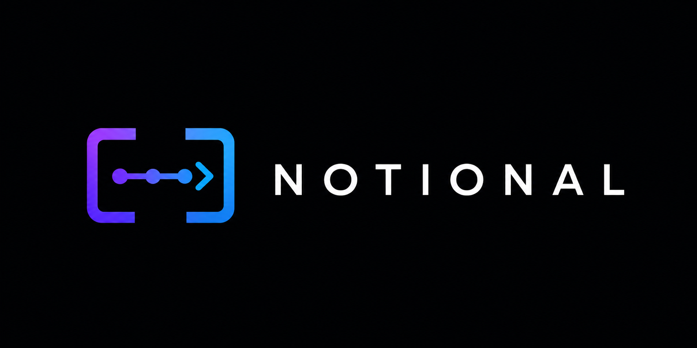
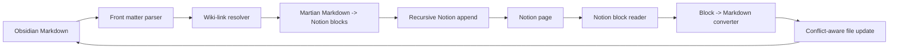

<p align="center">
  
</p>

<h3 align="center">Write in Obsidian. Share in Notion. Stop copy‑pasting between them.</h3>

<p align="center">
  <a href="https://github.com/bryanbans/Notional/releases"></a>
  <a href="https://github.com/bryanbans/Notional/actions/workflows/ci.yml"></a>
  <a href="LICENSE"></a>
  <a href="manifest.json"></a>
</p>

Notional is the missing bridge between the app where you *think* and the app where your team *works*. Draft in the speed and privacy of Obsidian, then send polished, fully‑formatted pages to Notion in one click — links intact, structure preserved, nothing overwritten by surprise.

---

## The problem you already know too well

You live in Obsidian. It's fast, it's private, it's *yours*. But the rest of the world lives in Notion — your clients, your teammates, your shared wikis.

So you copy. You paste. And it falls apart:

- 🔗 Your `[[wiki-links]]` turn into dead plain text.
- 📐 Your nested outlines flatten into mush.
- 👯 You end up with stale duplicates and no idea which one is current.
- 😤 You do it all again next week.

**Notional ends the copy‑paste tax.** One command, and your note lands in Notion looking the way it should.

---

## What it feels like

> You finish a note in Obsidian. You hit **Push**. Seconds later it's a clean Notion page your client can read — headings, checklists, tables, callouts, and your internal links converted into real Notion page mentions. You keep writing in Obsidian. Notion stays in sync. You never touch the clipboard.

---

## Who it's for

**🧑‍💼 The consultant**
You draft rough, honest notes in private — then your client expects a tidy Notion page. Push selected notes (or a whole project folder) straight to their workspace. Obsidian stays your backstage; Notion is the polished stage.

**🔬 The researcher**
Your vault is a web of linked ideas. Notional turns those wiki-links into clickable Notion **page mentions** and preserves your deep nesting — so your research becomes a real, navigable team knowledge base instead of a flat copy-paste dump.

**🗓️ The team lead**
Meeting notes start as fast local typing during the call. One click later they're a shared Notion doc your team can act on — and follow-up edits keep flowing.

**🛠️ The builder**
Specs and docs are faster to write in Markdown, but review and discovery happen in Notion. Keep your Markdown the source of truth, let the team comment in Notion, and **pull their changes back** when you're ready.

**📣 The publisher**
You want to share *part* of your vault, not expose every file path. Notional's scoped, folder-level publishing keeps you in control of exactly what goes public.

---

## Why you can trust it with your notes

Most sync tools make you nervous because you never know what they'll overwrite. Notional is built to be the opposite — **calm, predictable, and honest:**

- 🛟 **Never silently overwrites.** If both sides changed, Notional *stops and asks you* which version to keep. No surprise data loss, ever.
- 🔎 **Always inspectable.** The link between a note and its Notion page lives in plain front matter you can read. No black box.
- 🎛️ **You're in control.** Sync happens when *you* say so (automatic mode is strictly opt-in).
- 🔐 **Private by design.** With one-click connect, your credentials and tokens stay on *your device* and talk only to Notion — there's no Notional server in the middle, ever.

---

## Get started in ~3 minutes

### 1. Install

**Easiest:** open Obsidian → **Settings → Community plugins → Browse**, search **“Notional”**, Install, then Enable.

<details>
<summary>Other install options</summary>

Via [BRAT](https://github.com/TfTHacker/obsidian42-brat) (for early updates):

```text
bryanbans/Notional
```

Or manually from the [latest release](https://github.com/bryanbans/Notional/releases) into `<vault>/.obsidian/plugins/notional/` (`main.js`, `manifest.json`, `styles.css`), then reload Obsidian.
</details>

### 2. Connect your Notion

Open **Settings → Notional** and pick whichever path you like:

**Option A — Paste a token (fastest)**
1. Create a connection at [notion.so/my-integrations](https://www.notion.so/my-integrations) and copy its secret.
2. Paste it into **Notion API token**, then click **Test**.

**Option B — One-click “Connect with Notion” (OAuth)**
1. At [notion.so/profile/integrations](https://www.notion.so/profile/integrations) → **New connection → OAuth**.
2. Set the redirect URI to `https://bryanbans.github.io/Notional/oauth-callback.html`.
3. Copy the **client ID** and **client secret** into **Advanced → OAuth**.
4. Click **Connect with Notion**, approve the pages to share, and you're in — your secret never leaves your device.

**Then, point it at a home for your notes:**
1. Share a Notion page with your connection.
2. Paste that page's link into Notional and click **Create notes database** — Notional builds the database for you.

### 3. Sync your first note

Open any note and **Push** it (ribbon icon, the **Open sync panel** command, or the command palette). After that first push the note is linked — use **Sync** from then on for the safe, timestamp-aware path.

---

## Everything you can do

| Command | What it does |
| --- | --- |
| **Upload current note to Notion** | Publishes the note you're in |
| **Upload current folder to Notion** | Publishes a whole project folder at once |
| **Pull current note from Notion** | Brings teammates' Notion edits back into Obsidian |
| **Sync current note with Notion** | Picks the right direction automatically |
| **Open sync panel** | One-click control center for the active note |

**The sync panel** is your at-a-glance cockpit: linked status, last-synced and last-edited times, change indicators on both sides, one-click Push / Pull / Sync, a recent-activity log, and — when both sides changed — a clear choice between **Keep local** and **Keep Notion**. No guessing.

---

<details>
<summary><strong>Under the hood</strong> (for the curious / contributors)</summary>

### How sync works

1. A note links to a Notion page via YAML front matter.
2. **Push** converts Markdown → Notion blocks (via Martian), appending deeply nested blocks past Notion's per-call limit.
3. **Pull** converts supported Notion blocks back into Markdown.
4. **Sync** chooses a direction from stored timestamps.
5. If both sides changed, it pauses and asks — never an automatic merge.



Sync state is stored in each note's front matter, so the link travels with the file:

```yaml
notionPageId: ...
notionPageUrl: ...
notionLastEditedTime: ...
obsidianLastSyncedAt: ...
```

### Code map

| File | Responsibility |
| --- | --- |
| `main.ts` | Plugin lifecycle, commands, scoped folder upload, OAuth, autosync |
| `view.ts` | Sync side panel and conflict actions |
| `settingTab.ts` | Connection and setup UI |
| `service/index.ts` | Upload, pull, sync orchestration |
| `service/notion.ts` | Notion REST calls and block conversion |
| `service/oauth.ts` | OAuth URL + token exchange (direct, secret stays local) |
| `service/utils.ts` | Front matter, wiki-link parsing, URL helpers |
| `service/types.ts` | Shared settings and sync result types |

### Good to know

- Pull covers common blocks: paragraphs, headings, lists, to-dos, quotes, code, dividers, images, tables, callouts, toggles, equations, and media links.
- Unsupported blocks are flagged with a `> [!missing]` callout — never dropped silently.
- Automatic sync (opt-in) is scoped to the open note; conflicts are always deferred to the panel.
- Conflict handling is side-based; there's no line-level merge UI yet.

</details>

---

## Roadmap

**Shipped**
- ✅ One-click **Connect with Notion** (OAuth) — secret + token stay on your device, no third-party server
- ✅ Push notes and whole folders, with wiki-links → Notion page mentions
- ✅ Deep nested block upload
- ✅ Pull + Sync with timestamp conflict detection and a sync side panel
- ✅ Guided setup with connection testing and one-click database creation
- ✅ Opt-in automatic sync
- ✅ Listed in the Obsidian Community Plugins directory

**Next**
- Whole-vault background sync for linked notes
- Dedicated sync-state store for richer automation
- Broader pull conversion for edge-case Notion blocks

---

## Development

Requires Node.js.

```bash
npm install
npm run build
npm run lint
npm test
```

Release assets are `main.js`, `manifest.json`, and `styles.css`. Tagging a commit whose name matches the `manifest.json` version (no `v` prefix) publishes a GitHub release with those assets and build-provenance attestations.

## Acknowledgements

Notional is a maintained fork of the original Nobsidion work by
[Quan Phan](https://github.com/quanphan2906), which itself traces back to
[Obsidian to Notion](https://github.com/EasyChris/obsidian-to-notion/) by
[EasyChris](https://github.com/EasyChris).

## License

Notional is released under the [GNU General Public License v3.0](LICENSE).
